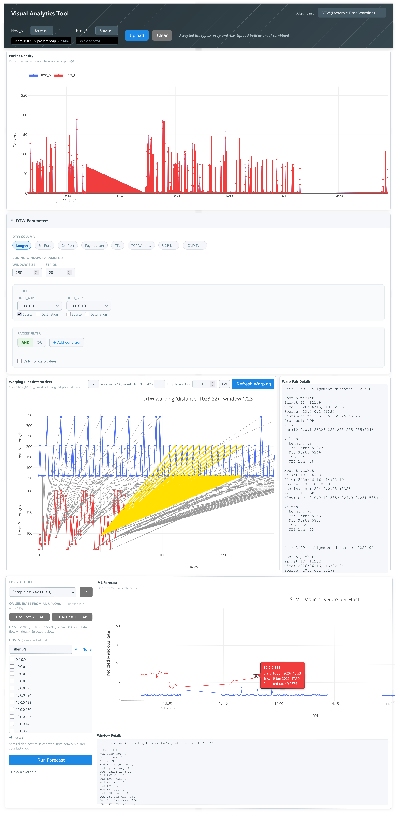

# Visual Analytics Tool

A web tool for comparing network traffic between two hosts using Dynamic Time Warping (DTW), with an LSTM/GRU forecast mode for predicting malicious traffic rates.

Upload one or two PCAP/CSV captures and the tool aligns the two packet sequences with DTW, letting you inspect matched packet pairs on an interactive warping plot. Switch to LSTM or GRU mode to run flow-based malicious-rate forecasting on a CICFlowMeter-format CSV instead.


## Requirements

- Python 3.10+
- `tcpdump` on PATH (used by scapy for offline PCAP parsing and by the PCAP-to-CSV conversion)

## Setup
1. Install Python dependencies from the requirements.txt file:
```bash
pip install -r requirements.txt
```
2. Install `tcpdump` package, which is available in all the popular Linux distribution repositories.

## Running

```bash
python3 app.py
```

Then open `http://127.0.0.1:5001`.

## Usage

**DTW mode**: upload one or two captures under Host_A / Host_B, pick a column to compare (packet length, TTL, TCP window, etc.), and the warping plot below shows the alignment. Use the sliding window settings to break a long capture into manageable chunks, and the IP/packet filters to narrow down which traffic gets compared.

**LSTM/GRU mode**: switch the algorithm dropdown, pick (or convert from an uploaded PCAP) a forecast CSV, optionally narrow to specific hosts, and run the forecast. Each host gets its own line plus a star marking the model's prediction for the next window beyond the data. Click any point to see the raw flow record(s) behind it.

## Preview



